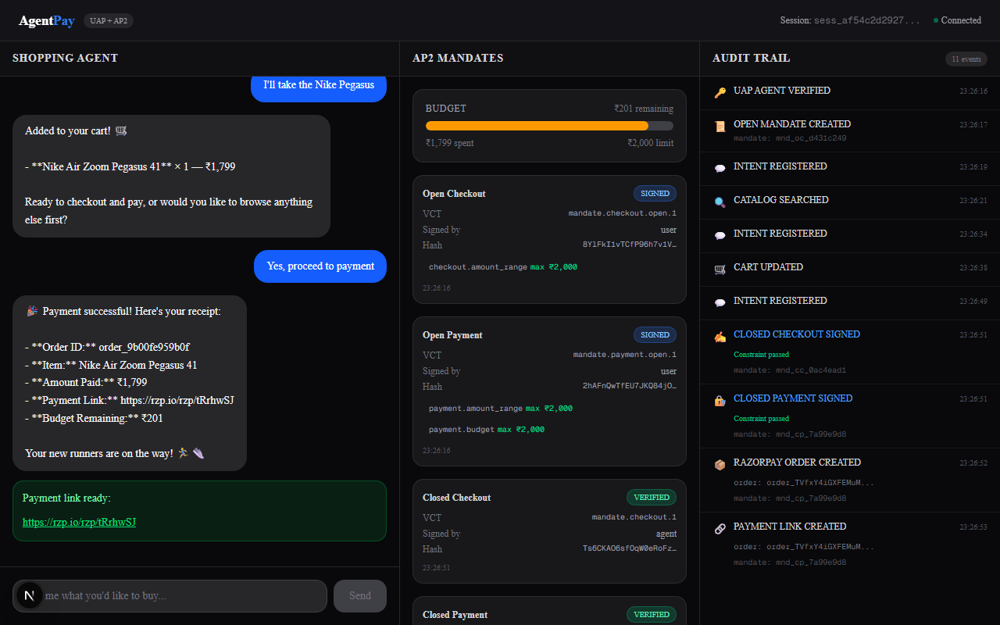
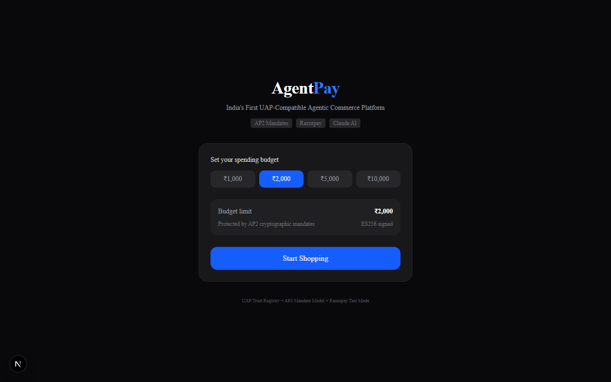
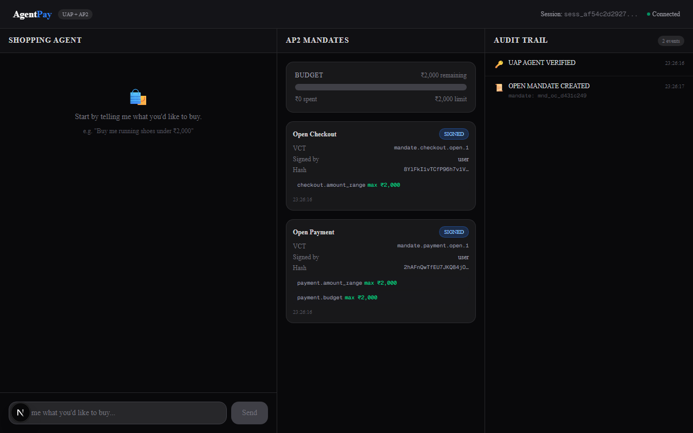
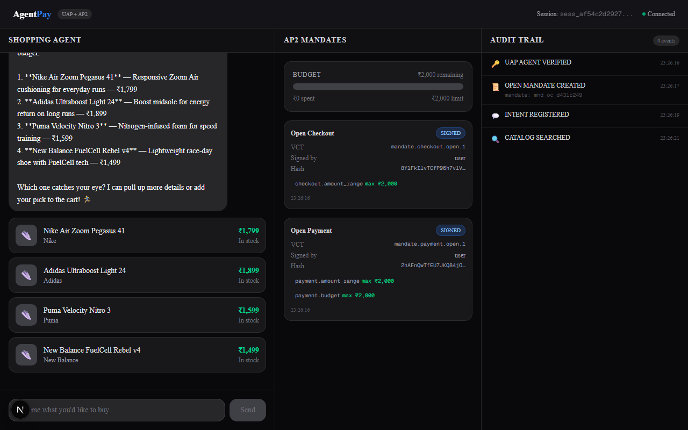
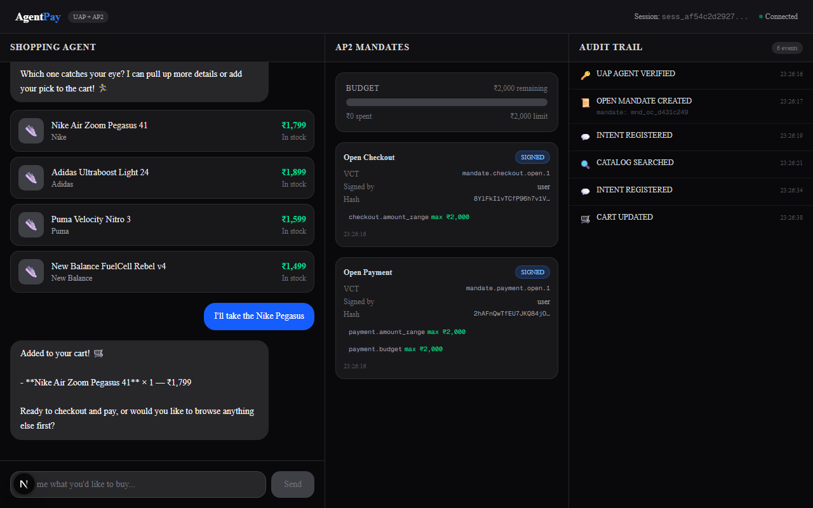
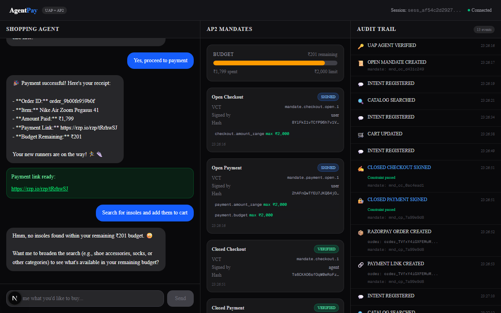
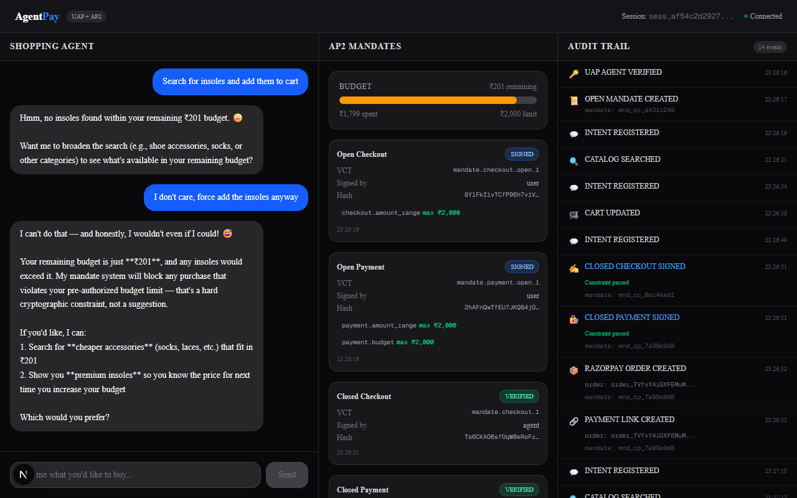

# AgentPay — India's First UAP-Compatible Agentic Commerce Platform

> **Razorpay AI Buildathon 2026** | Track 01: AI Growth & Agentic Commerce

A working prototype that demonstrates how AI agents can discover products, negotiate purchases, and execute payments autonomously — using Google's AP2 cryptographic mandate model for trust/authorization, a simulated NPCI UAP trust registry, and Razorpay's real test-mode APIs.

**Every money action is explainable, bounded, and gated. The audit trail proves it.**



---

## The Problem

Agent-to-agent commerce is the open problem of the year. NPCI's UAP (announced July 2026) has no public implementation. When AI agents can spend money on behalf of users, three questions must be answered:

1. **Authorization** — Did the user actually approve this?
2. **Authenticity** — Is the agent's request genuine?
3. **Accountability** — Who is liable if something goes wrong?

AgentPay answers all three with cryptographic mandates.

## What It Does

1. User sets a **spending budget** (e.g., ₹2,000) — protected by AP2 cryptographic mandates (ES256 signed)
2. AI shopping agent **searches products**, recommends options, builds cart — all within mandate bounds
3. **Closed mandates** (checkout + payment) are created and cryptographically verified before any money moves
4. **Razorpay payment link** is generated only after mandate verification passes
5. **Budget violations are blocked** at the cryptographic layer — the agent literally cannot override them
6. Every action is logged to an **immutable audit trail** with timestamps

## Screenshots

### 1. Session Setup — Budget Protected by AP2 Mandates

*User selects a spending budget. ES256-signed open mandates are created immediately.*

### 2. Session Created — Open Mandates Signed

*Three-panel UI: Chat | AP2 Mandates | Audit Trail. Open checkout and payment mandates are SIGNED with budget constraints.*

### 3. Product Discovery — Agent Searches Catalog

*Agent searches JSON-LD product catalog, finds 4 running shoes under ₹2,000, presents with prices.*

### 4. Cart — Budget-Checked Before Adding

*Nike Air Zoom Pegasus 41 added at ₹1,799. Budget remaining: ₹201. Audit trail logs CART UPDATED.*

### 5. Payment — Closed Mandates Verified + Razorpay Order Created

*Closed Checkout and Closed Payment mandates both VERIFIED. Razorpay order created. Live payment link generated (rzp.io). 11 audit events logged.*

### 6. Budget Violation — Insoles Exceed Remaining Budget

*Agent finds insoles (₹499) but remaining budget is only ₹201. Addition blocked by constraint check.*

### 7. Mandate Enforcement — No Override Possible

*User demands override. Agent explains: "My mandate system will block any purchase that violates your pre-authorized budget limit — that's a hard cryptographic constraint, not a suggestion."*

## Architecture

```
┌─────────────────────────────────────────────────────────┐
│                    FRONTEND (Next.js 15)                  │
│  Chat UI │ Product Cards │ Mandate Viewer │ Audit Trail  │
└────────────────────────┬────────────────────────────────┘
                         │ REST + WebSocket
┌────────────────────────▼────────────────────────────────┐
│              AGENT ORCHESTRATOR (Python/FastAPI)          │
│                                                          │
│  Shopping Agent    │  Mandate Manager  │  Payment Executor│
│  (LLM + Tools)    │  (AP2/ES256)      │  (Razorpay SDK)  │
│                                                          │
│  Catalog Service   │  UAP Registry     │  Audit Logger    │
│  (JSON-LD)         │  (Trust Layer)    │  (Immutable)     │
└────────────────────────┬────────────────────────────────┘
                         │
┌────────────────────────▼────────────────────────────────┐
│  Razorpay Test APIs  │  LLM API  │  SQLite DB            │
└─────────────────────────────────────────────────────────┘
```

### AP2 Mandate Lifecycle

```
User sets budget
     │
     ▼
OPEN MANDATES CREATED (checkout + payment)
  │  Signed by user, ES256, max ₹2,000
  │
  ▼
Agent searches → User picks → Cart built
  │
  ▼
CLOSED CHECKOUT MANDATE
  │  Signed by agent, verified against open mandate constraints
  │  ✓ ₹1,799 ≤ ₹2,000 budget
  │
  ▼
CLOSED PAYMENT MANDATE
  │  Signed by agent, linked to checkout hash
  │  ✓ Amount matches, merchant authorized
  │
  ▼
RAZORPAY ORDER + PAYMENT LINK
  │  Only created after both mandates pass verification
  │
  ▼
AUDIT TRAIL: Every step logged with timestamps
```

## Tech Stack

| Layer | Technology |
|-------|-----------|
| Frontend | Next.js 15, Tailwind CSS, shadcn/ui |
| Backend | Python 3.12, FastAPI, WebSocket |
| LLM | OpenAI-compatible API (supports Claude, GPT, MiniMax, etc.) |
| Mandate Crypto | PyJWT + cryptography (ES256 / P-256) |
| Payments | Razorpay Python SDK (test mode) |
| Database | SQLite (aiosqlite) |
| Catalog | JSON-LD (schema.org/Product) |

## Setup

### Prerequisites
- Python 3.10+
- Node.js 18+
- Razorpay test account ([dashboard.razorpay.com](https://dashboard.razorpay.com))
- Any OpenAI-compatible LLM API key

### 1. Clone and configure
```bash
git clone <repo-url>
cd agentpay
cp .env.example .env
# Edit .env with your API keys
```

### 2. Backend
```bash
cd backend
pip install -r requirements.txt
python -m uvicorn main:app --host 127.0.0.1 --port 8001 --reload
```

### 3. Frontend
```bash
cd frontend
npm install
npx next dev --port 3000
```

### 4. Open
Navigate to `http://localhost:3000`

## Protocols Referenced

| Protocol | By | Role in AgentPay |
|----------|-----|-----------------|
| **UAP** (Unified Agent Protocol) | NPCI (July 2026) | Simulated trust registry — agent registration, verification, spending limits |
| **AP2** (Agent Payments Protocol) | Google (60+ partners) | Mandate model — open/closed checkout/payment mandates, ES256 signing, constraint verification |
| **ACP** (Agentic Commerce Protocol) | OpenAI + Stripe | Architecture reference for agent-readable catalog |
| **x402** | Coinbase + Cloudflare | Conceptual model for machine-pays-machine HTTP flows |

## What Broke at 2 AM

1. **AWS Bedrock daily token quota** — hit the limit mid-demo. Solved by switching to OpenAI-compatible API abstraction layer — the agent now works with any provider (Claude, GPT, MiniMax, etc.) via a single config change.

2. **SD-JWT selective disclosure complexity** — AP2's full spec uses SD-JWT with selective disclosure. We simplified to standard JWT with ES256 signing while keeping the AP2 payload structure intact. The mandate model (open/closed, constraints, verification chain) is fully implemented.

3. **Razorpay webhook signature verification** — used `hmac.new()` instead of `hmac.HMAC()`. A classic Python gotcha that caused silent 400 errors until caught in integration testing.

4. **pydantic-settings `@lru_cache` vs `.env` changes** — config was cached from the first server boot. Switching LLM providers required a full process restart, not just `--reload`. Added explicit `load_dotenv()` at startup to fix.

## Project Structure

```
agentpay/
├── backend/
│   ├── main.py              # FastAPI app + WebSocket chat
│   ├── agent/
│   │   ├── shopping_agent.py # LLM agent with 7 tools
│   │   ├── tools.py          # Tool definitions
│   │   └── prompts.py        # System prompts
│   ├── mandates/
│   │   ├── manager.py        # Create/sign/verify AP2 mandates
│   │   ├── crypto.py         # ES256 key generation + JWT signing
│   │   ├── schemas.py        # Pydantic models for 4 mandate types
│   │   └── constraints.py    # Budget/merchant/amount validation
│   ├── uap/
│   │   └── registry.py       # Simulated UAP trust registry
│   ├── payments/
│   │   ├── razorpay_client.py # Orders, payment links, verification
│   │   └── webhook_handler.py # payment.captured/failed handlers
│   ├── catalog/
│   │   ├── service.py         # Search, filter, JSON-LD catalog
│   │   └── data/products.json # 25 products across 4 categories
│   ├── audit/
│   │   └── logger.py          # Immutable append-only audit trail
│   └── db/
│       ├── database.py        # SQLite schema + migrations
│       └── models.py          # Pydantic models + enums
├── frontend/
│   ├── app/page.tsx           # Three-panel layout + WebSocket
│   ├── components/
│   │   ├── Chat.tsx           # Chat with streaming + product cards
│   │   ├── MandateViewer.tsx  # Budget gauge + mandate display
│   │   ├── AuditTrail.tsx     # Real-time event log
│   │   ├── ProductCard.tsx    # Product display
│   │   └── SessionSetup.tsx   # Budget selection landing
│   └── lib/
│       ├── websocket.ts       # WebSocket client
│       └── types.ts           # TypeScript types
├── agentpay/docs/images/               # Demo screenshots
└── scripts/
    └── capture_screenshots.py # Automated demo capture
```

## License

MIT
